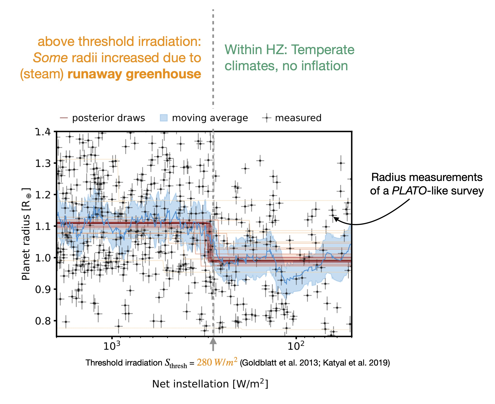

# The Habitable Zone Inner Edge Discontinuity
A _Bioverse_ paper on the imprints of runaway greenhouse climates on exoplanet demographics. 

[//]: # (
)

[//]: # ()

[//]: # (
)

 

 

 

 

## Scope
This repository contains the code necessary to create the results and figures in [Schlecker et al. 2023 (accepted to PSJ)](https://github.com/matiscke/hz-inner-edge-discontinuity). In this study, we assess the ability of near-future exoplanet missions to detect a demographic imprint of the runaway greenhouse transition – the inner edge of the classical habitable zone.
Using the [Bioverse](https://github.com/danielapai/bioverse) framework, we show that this imprint, the _Habitable Zone Inner Edge Discontinuity_, is likely detectable with a transit survey like PLATO. 
We also determine survey strategies and design trades that maximize the diagnostic power to test runaway greenhouse climate models.

## Video Abstract

## Reproducibility
All code needed to reproduce the paper can be found in this repo. The manuscript is autocompiled using the [showyourwork](https://github.com/rodluger/showyourwork) workflow.
Click [**here**](https://github.com/matiscke/hz-inner-edge-discontinuity/raw/main-pdf/ms.pdf) to read the accepted version of our paper.

[//]: # (Once paper is out: Explain usage, dependencies, data sets similar to https://github.com/katiebreivik/hush)
